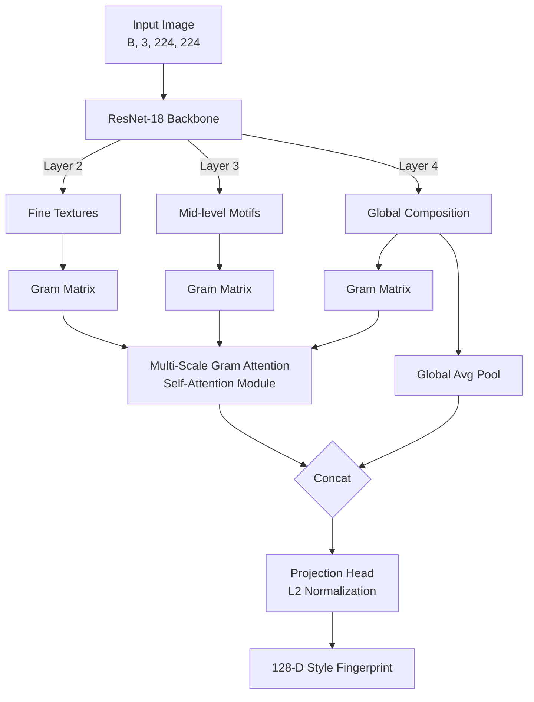

# Imprint: Few-Shot Artistic Style Attribution with Multi-Scale Gram Attention

Imprint is a research-grade, deep metric learning style attribution system designed to combat intellectual property (IP) theft and stylistic plagiarism (e.g., unauthorized mimicry of digital artists by generative AI models). 

By extracting texture correlations and using self-attention to weight different network depths, Imprint produces a continuous 128-dimensional **"Style Fingerprint"** representing an artist's signature technique, independent of semantic content (subject matter).

---

## 🚀 Key Performance Metrics

The system was evaluated across three core metric groups, demonstrating outstanding performance in open-set, few-shot environments:

### 1. Pairwise Style Verification
Measures the model's ability to verify if two different artworks share a stylistic lineage:
- **ROC-AUC**: `0.8243` (The probability that a matching style pair is ranked higher than a non-matching pair)
- **Equal Error Rate (EER)**: `24.58%`

### 2. Gallery Retrieval (Recall@K)
Evaluates similarity search performance across a database of pre-computed embeddings:
- **Recall@1**: `34.12%`
- **Recall@5**: `61.07%`
- **Recall@10**: `73.27%`
- **Mean Average Precision (mAP)**: `41.24%`

### 3. Open-Set Few-Shot Classification
Measures the system's ability to classify unseen query paintings into a set of 5 completely novel artists using only a handful of references (support set):
- **5-Way 1-Shot Accuracy**: `61.44% ± 1.97%`
- **5-Way 3-Shot Accuracy**: `67.72% ± 1.86%`
- **5-Way 5-Shot Accuracy**: `68.92% ± 1.69%`

---

## 🎨 Core Architecture (MSGMAtt)

Imprint utilizes a dual-pathway feature extractor mapping images into a 128-D L2-normalized Euclidean hypersphere:

1. **Multi-Scale Gram Matrix Attention (MSGMAtt)**: 
   - Intercepts a pre-trained **ResNet-18** backbone at intermediate feature layers: Layer 2 (fine brushstrokes), Layer 3 (motifs), and Layer 4 (macro composition).
   - Spatial dimensions are collapsed into Gram matrices to discard spatial content layouts and extract pure statistical texture correlations.
   - A Multi-Head Self-Attention module dynamically weights these scales (e.g., Pointillism relies on Layer 2, Cubism on Layer 4).
2. **Global Structural Branch**:
   - Captures global composition via a Global Average Pool (GAP) branch, fused with the attention-weighted Gram features.
3. **Attentive Prototypical Verification**:
   - Replaces naive mean prototype averaging with a cross-attention layer, building query-conditioned prototypes that handle multi-modal artist eras.



---

## 🔍 Robust Gradio Web Interface

The updated codebase includes a premium, dark-mode adapted Gradio frontend (`frontend/app_gradio.py`) featuring:

1. **Gallery Search**: Compute the 128-D style fingerprint and run a cosine similarity query against the local database (`data/style_database.pt`).
2. **Deep Style Analysis**:
   - A 1-to-1 comparison of two artworks showing the **Cosine Similarity Percentage**.
   - **Explainable AI (XAI) Heatmaps**: Bilinear-interpolated overlays showing spatial activation energy (Layer 4) to verify that the network ignores semantic objects (e.g., houses, faces) and focuses on brushwork.
   - **Out-of-Distribution (OOD) Safeguard**: Explicit warning trigger (`gr.Warning`) if cosine similarity falls below **`40%`**, preventing false positive attributions for unknown styles.
   - **MSGMAtt Breakdown**: Interactive Plotly bar chart indicating the exact scale contribution (Layer 2 vs 3 vs 4) driving the similarity.

---

## 🛠️ Project Structure

```
imprint/
├── configs/
│   └── default.yaml            # Configs for data, model, and training
├── src/
│   ├── data/
│   │   ├── dataset.py          # StyleDataset with error-handling fallback
│   │   ├── transforms.py       # Style-preserving crops & flips
│   │   └── sampler.py          # BalancedBatchSampler (P × K classes)
│   ├── models/
│   │   ├── backbone.py         # Hook-based intermediate feature extractor
│   │   ├── gram_attention.py   # Multi-scale Gram matrix self-attention
│   │   ├── encoder.py          # Unified StyleEncoder pipeline
│   │   └── prototypical.py     # Cross-attentive prototypical verification
│   ├── training/
│   │   ├── losses.py           # Joint Triplet + Prototypical Loss
│   │   ├── miners.py           # Online semi-hard triplet mining
│   │   └── lightning_module.py # PyTorch Lightning module wrapper
│   ├── evaluation/
│   │   ├── metrics.py          # Verification, retrieval, few-shot calculations
│   │   └── visualize.py        # UMAP and Attention distribution plotting
│   └── utils/
│       └── helpers.py          # Configuration loading, seeds, loggers
├── frontend/
│   ├── app.py                  # Streamlit alternative interface
│   ├── app_gradio.py           # Optimized Gradio UI with XAI heatmaps
│   └── examples/               # Example images for testing (Mondrian)
├── scripts/
│   ├── prepare_data.py         # Setup train/val/test CSV splits
│   ├── train.py                # Lightning model training script
│   ├── evaluate.py             # Computes metrics and exports visual plots
│   ├── build_database.py       # Generates retrieval vector database
│   └── generate_plots.py       # Re-creates ROC & Few-Shot metric curves
├── Makefile                    # Developer commands (setup, train, app, etc.)
├── setup_mac.sh                # macOS environment helper script
└── requirements.txt            # Python dependencies
```

---

## 🚀 Quick Start

### 1. Setup Environment
Clone the repository, go into the directory, and run the setup commands to build the virtual environment and install all dependencies:
```bash
make setup
```

### 2. Data Preparation
To partition the artists dataset into split index sets:
```bash
python scripts/prepare_data.py
```

### 3. Model Training
Train the network using PyTorch Lightning (automatically activates hardware acceleration and 16-bit mixed precision):
```bash
make train
```

### 4. Running Evaluation & Generating Plots
To compute testing set metrics and output visual files (`outputs/umap_embeddings.png` and `outputs/attention_weights.png`):
```bash
make evaluate
```
If you wish to specifically recreate the ROC and few-shot metric charts:
```bash
python scripts/generate_plots.py
```

### 5. Pre-computing the Vector Database
Extract features of reference artworks to build the search index:
```bash
make database
```

### 6. Launch the Interactive App
Start the optimized Gradio UI locally:
```bash
make app
```
This launches a browser-accessible web application at `http://127.0.0.1:7860/` with a link to share the interface publicly.

---

## 👥 Contributors

- **Vidhi Sharma** (b24es1034)
- **Alankrita Singh** (b24mt1004)
